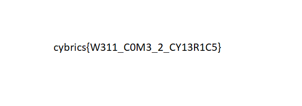

# Zakukozh

- Category: Crypto
- Rating: Baby
- points: 10

# Challenge

>Zakukozh (Cyber, Baby, 10 pts) Author: Khanov Artur (awengar)
This image containing flag is encrypted with affine cipher. Scrape it

We are given a file encrypted using the affine cipher


Taking a look at Wikipedia's description, it looks like encryption and decryption use the same formula `(ax + b) % m` with different parameters, namely `a` and `b`, which we can probably brute force. Also note the a and m have to be coprime, which reduces the search space quite a bit.

We still have to determine our `m` though. In this case we are using the cipher on a file, i.e. on its bytes which go from `00` to `FF`, thus `m = 256`.

We will know to stop when we detect `png` or `jpeg` magic bytes at the beginning of the file. Seems that everything is in order, let's get cracking.

# Solution

```python
from math import gcd

data = bytearray(open('zakukozh.bin', 'rb').read())
m = 256

def affine(n, a, b):
    return (a*n + b) % m

for a in range(m):
    if gcd(a, m) != 1: # This is a necessary condition for a
        continue
    for b in range(m):
        new = [affine(data[0],a,b), affine(data[1],a,b)] # decode just the first 2 bytes
        if new == [255, 216]: # jpg magic
            print("possible jpg:",a,b)
        if new == [137,80]: # png magic
            print("possible png:",a,b)

# We get one of each in a flash
# possible jpg: 177 159
# possible png: 239 233

# decode the whole file now using the a and b we found
jpg = bytearray([affine(b,177,159) for b in list(data)]) 
png = bytearray([affine(b,239,233) for b in list(data)])
open('out.jpg','wb').write(jpg)
open('out.png','wb').write(png)
```
Running file on both shows some metadata for the png which looks promising.

And it is the flag.


# Flag

`cybrics{W311_C0M3_2_CY13R1C5}`

