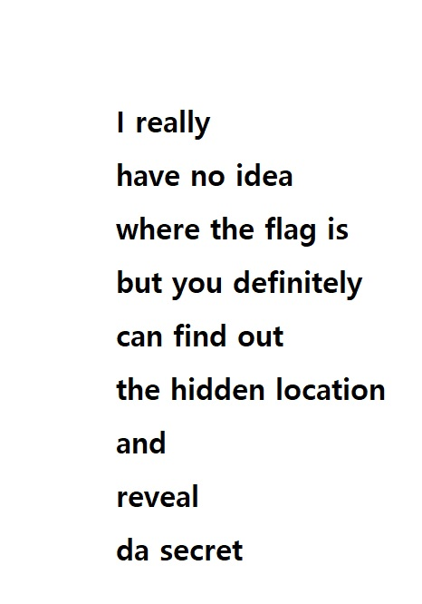
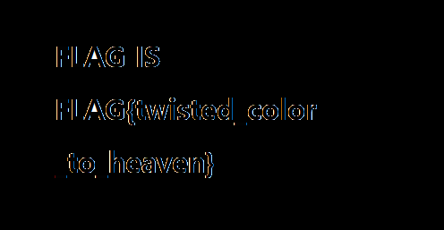

# sgtoe2

- Level: medium
- Points: 100
- Category: Forensics

We are greeted by an innocent looking jpg 



Running file, exiftool or a standard steg tool doesn't return anything interesting,
running binwalk however does 
```
DECIMAL       HEXADECIMAL     DESCRIPTION
--------------------------------------------------------------------------------
0             0x0             JPEG image data, JFIF standard 1.01
44418         0xAD82          PNG image, 496 x 257, 8-bit/color RGB, non-interlaced
44496         0xADD0          Zlib compressed data, compressed
```

# Solution 

A simple calculation using the size of the file and the offset and the png header tells us that the png begins at 5953 bytes from the bottom
```bash
tail -c 5953 target.jpg > img.png
```

# Flag


