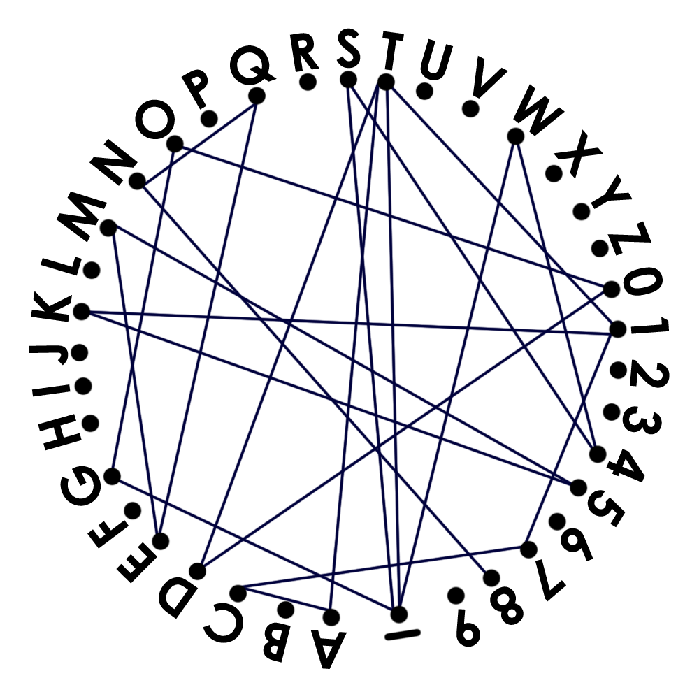

# Lines

- Category: Crypto
- Rating: Hard

We have a graph problem on our hands. Since one of the nodes is an underscore, we can be sure that the correct path through the graph will spell out the flag.


We can already notice a few things about the graph

- Most of the nodes have 2 edges connected to them, so they're probably show up only once (if they show up more times I'll mean that the same word shows up twice which is improbable)
- `T` and `_` have more edges than the other nodes which probably means they show up twice in the graph
- `8` only has one edge, so there's a good chance our flag either starts or ends there (or the flag will contain N8N which again, is unlikely) and the same goes for `1`

At this point we can probably figure it out manually, but let's write some networkx code.

# Solution

First we set up our graph
```python
G = nx.Graph()
nodes = string.ascii_uppercase + string.digits + "_"
edges = {
    'A':['C','T'],
    'C':['A','7'],
    'D':['T','0'],
    'E':['Q','M'],
    'G':['O','_'],
    'K':['5','1'],
    'M':['E','5'],
    'N':['8','Q'],
    'O':['G','0'],
    'Q':['N','E'],
    'S':['_','4'],
    'T':['D','A','_','1'],
    'W':['_','4'],
    '0':['O','D'],
    '1':['T','K','7'],
    '4':['W','S'],
    '5':['M','K'],
    '7':['1','C'],
    '8':['N'],
    '_':['G','S','T','W'],
}

for n in nodes: G.add_node(n)
for k, v in edges.items():
        for c in v:
                G.add_edge(k,c)
```
Add in some code swiped off stackoverflow
```python
def find_all_paths(graph, start, end):
    path  = []
    paths = []
    queue = [(start, end, path)]
    while queue:
        start, end, path = queue.pop()
        print('Looking...', ''.join(path))

        path = path + [start]
        if start == end:
            paths.append(''.join(path))
        for node in set(graph[start]).difference(''.join(path)):
            queue.append((node, end, path))
    return paths
```
Now let's find some valid candidates, keeping in mind that there will be underscores between words

```python
print("Start candidates---------------------")
for n in nodes:
        for path in find_all_paths(G,n,'_'):
                print(''.join(path))
print("Finish candidates---------------------")
for n in nodes:
        for path in find_all_paths(G,'_',n):
                print(''.join(path))
print("Middle candidates---------------------")
for path in find_all_paths(G,'_','_'):
        print(''.join(path))
```
```bash
$ python gen.py
...
('Looking...', '_G')
('Looking...', '_GO')
('Looking...', '_GO0')
('Looking...', '_GO0D')
('Looking...', '_GO0DT')
('Looking...', '_GO0DT1')
('Looking...', '_GO0DT17')
('Looking...', '_GO0DT17C')
('Looking...', '_GO0DT1')
('Looking...', '_GO0DT1K')
('Looking...', '_GO0DT1K5')
('Looking...', '_GO0DT1K5M')
('Looking...', '_GO0DT1K5ME')
('Looking...', '_GO0DT1K5MEQ')
('Looking...', '_GO0DT1K5MEQN')
('Looking...', '_GO0DT')
('Looking...', '_GO0DTA')
('Looking...', '_GO0DTAC')
('Looking...', '_GO0DTAC7')
('Looking...', '_GO0DTAC71')
('Looking...', '_GO0DTAC71K')
('Looking...', '_GO0DTAC71K5')
('Looking...', '_GO0DTAC71K5M')
('Looking...', '_GO0DTAC71K5ME')
('Looking...', '_GO0DTAC71K5MEQ')
('Looking...', '_GO0DTAC71K5MEQN')
('Looking...', '_GO0DTAC71K5MEQN8')
...
('Looking...', 'W4S_GO0DTAC')
('Looking...', 'W4S_GO0DTAC7')
('Looking...', 'W4S_GO0DTAC71')
('Looking...', 'W4S_GO0DTAC71K')
('Looking...', 'W4S_GO0DTAC71K5')
('Looking...', 'W4S_GO0DTAC71K5M')
('Looking...', 'W4S_GO0DTAC71K5ME')
('Looking...', 'W4S_GO0DTAC71K5MEQ')
('Looking...', 'W4S_GO0DTAC71K5MEQN')
('Looking...', 'W4S_GO0DTAC71K5MEQN8')
...
('Looking...', '8NQEM5K1T')
('Looking...', '8NQEM5K1T_')
('Looking...', '8NQEM5K1T_G')
('Looking...', '8NQEM5K1T_GO')
('Looking...', '8NQEM5K1T_GO0')
...
```
Using these results and retracing the graph manually,
we have a few pieces to play with, namely `1T_W4S_GO0DTAC71K5`, `MEQN8`, and `8NQEM1T_GO0D`.

A bit of guesswork later we find the flag `1t_w4s_go0dtac71k5meqn8`. Yes it was lowercase. Yes I know it doesn't make sense.

# Flag

`InnoCTF{1t_w4s_go0dtac71k5meqn8}`
