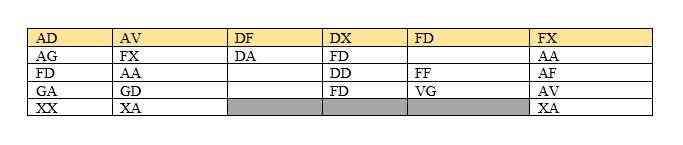

# Use Alphabet!

- Category: Crypto
- Rating: Hard

In this challenge we are given a png that was supposedly sent by a German friend

This is clearly an [ADFGVX cipher](https://en.wikipedia.org/wiki/ADFGVX_cipher), as those are the only letters that show up.
The encryption process is in two stages
- First, a 6x6 polybius square is used as a simple substitution cipher

- Second, the resulting AGFGVX pairs are put into columns and scrambled using a keyword

Now, if take a look again at the `task.png`, we can eliminate it being related to the polybius square because it's only 6x5. So It's probably meant to be the table from the second stage. i.e. The keyword is 6 letters.

Another hint is the name of the challenge `Use Alphabet!`. This obviously refers to the polybius square since it's not the right length to be the keyword.

Let's try it.

# Solution 

This is our polybius square for the subtitution:

|   | A | D | F | G | V | X |
|---|---|---|---|---|---|---|
| A | A | B | C | D | E | F |
| D | G | H | I | J | K | L |
| F | M | N | O | P | Q | R |
| G | S | T | U | V | W | X |
| V | Y | Z | 0 | 1 | 2 | 3 |
| X | 4 | 5 | 6 | 7 | 8 | 9 |

| B | E | I | L | N | R |
|---|---|---|---|---|---|
| D | R | G | N |   | A |
| N | A |   | H | O | C |
| S | T |   | N | 1 | E |
| 9 | 4 |   |   |   | 4 |

And now we can see that the keyword is obviously supposed to be `BERLIN`

| B | E | R | L | I | N |
|---|---|---|---|---|---|
| D | R | A | N | G |   |
| N | A | C | H |   | O |
| S | T | E | N |   | 1 |
| 9 | 4 | 4 |   |   |   |

`DRANG NACH OSTEN 1944`

# Flag

`InnoCTF{drang_nach_osten_1944}`